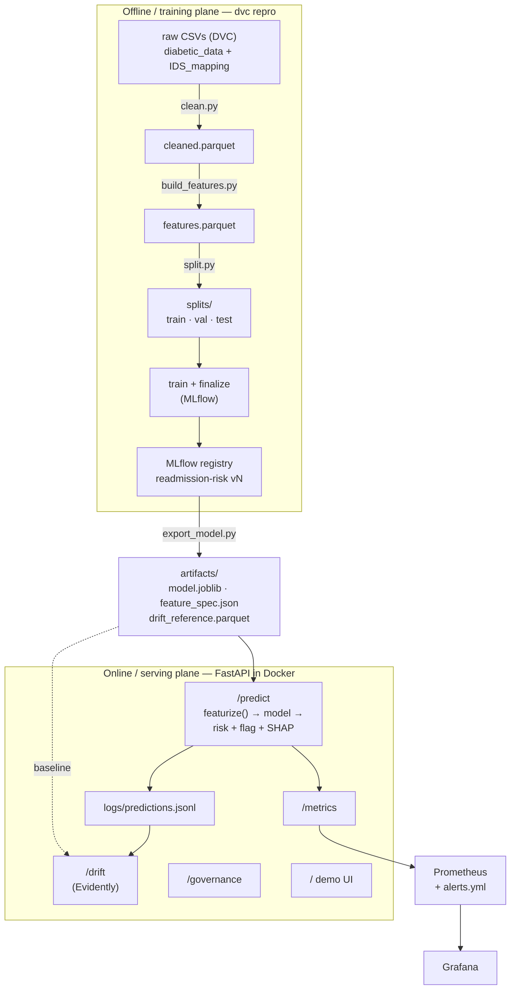
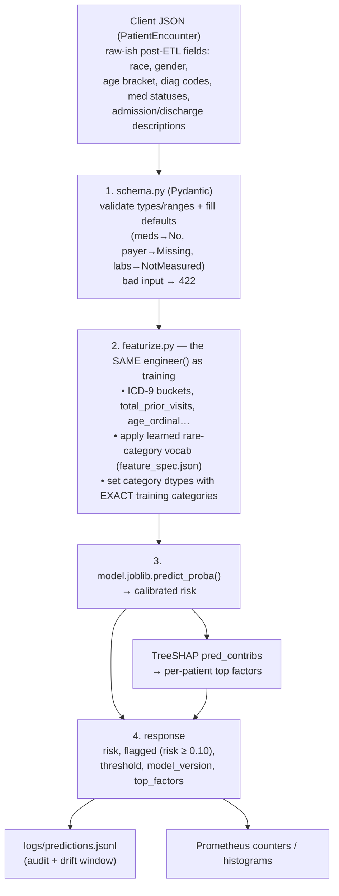

# System Architecture & Data Flow

One document that stitches the whole project together: how data moves from the raw CSV to
a live risk score, and where monitoring and governance plug in. Each stage is described as
**input → what happens → output (file)** so you can trace any value end to end.

There are two "planes", and keeping them separate is the key mental model:

- **Offline / training plane** — a batch pipeline that turns 100k historical encounters
  into a registered, calibrated model and a set of small serving artifacts. Runs on your
  machine (or CI), driven by DVC.
- **Online / serving plane** — a FastAPI service that scores one patient at a time using
  *only* those small artifacts. Runs in a container (locally via compose, later Cloud Run).

The bridge between the two planes is the **export step**: it freezes everything serving
needs into `artifacts/`, so the live service never touches the training data, MLflow, or
DVC.

---

## 1. The big picture



---

## 2. Offline plane — stage by stage

The first three stages are a **DVC pipeline** (`dvc.yaml`); run the whole thing with
`uv run dvc repro`. DVC re-runs only stages whose inputs changed and pins data+code+output
hashes together per git commit (lineage).

### Stage 0 — EDA (exploration only)
- **Input:** raw `data_folder/diabetic_data.csv`.
- **What:** profiling in `notebooks/` — dtypes, missingness (after `?`→NaN), cardinality,
  class balance (~11% positive). **Nothing load-bearing lives here**; findings graduate
  into the cleaning/feature code.
- **Output:** understanding + a saved profile. Not consumed by later code.

### Stage 1 — Preprocessing / cleaning  (`src/data/clean.py`)
- **Input:** `data_folder/diabetic_data.csv` + `IDS_mapping.csv` (both DVC-tracked).
- **What:** `?`→NaN; drop `weight` (~97% missing) and single-valued columns; keep
  informative missingness as explicit categories (`Missing`, A1C/glucose `NotMeasured`);
  map the three ID columns via `IDS_mapping`; **filter out encounters that can't be
  readmitted** (expired/hospice discharge); define the binary target
  (`readmitted == "<30"` → 1). A pandera schema validates the result.
- **Output:** `data_folder/processed/cleaned.parquet` — one standardized row per
  encounter (~99k rows). **This is the "post-ETL" level the serving API also speaks.**

### Stage 2 — Feature engineering  (`src/features/build_features.py`)
- **Input:** `cleaned.parquet`.
- **What:** `engineer()` (deterministic, row-wise) adds the modeling features — ICD-9
  `diag_1/2/3` → clinical buckets, `total_prior_visits`, `n_med_changes`, `n_active_meds`,
  `age_ordinal`, `diabetes_diag_any`. `lump_rare()` (the one *fitted* transform) collapses
  rare `medical_specialty`/`payer_code` categories (<1% of training) into `Other`.
- **Output:** `data_folder/processed/features.parquet` — the model-ready matrix (the
  "features folder"). This is what modeling picks up.

### Stage 3a — Splitting  (`src/models/split.py`)
- **Input:** `features.parquet`.
- **What:** **GroupShuffleSplit by `patient_nbr`** (70/15/15) so a patient never spans two
  splits (prevents leakage — the same patient has multiple encounters).
- **Output:** `data_folder/processed/splits/{train,val,test}.parquet`.

### Stage 3b — Modeling  (`src/models/train.py`, `finalize.py`)  *(not a DVC stage; uses MLflow)*
- **Input:** the splits.
- **What:** `train.py` fits the logistic baseline + XGBoost + LightGBM, tunes with
  `StratifiedGroupKFold`, and logs every run to MLflow (params, PR-AUC, recall@precision,
  Brier, calibration). `finalize.py` takes the winner (XGBoost), wraps it in **isotonic
  calibration**, picks the **cost-based operating threshold (0.10)**, evaluates on the
  **test split exactly once**, writes `src/models/final_model_report.json`, and
  **registers** the model as `readmission-risk vN` in the MLflow registry.
- **Output:** a registered, versioned model + the test report. The test set is touched
  only here, only once.

### Stage 3c — Export (the bridge)  (`src/api/export_model.py`)
- **Input:** the registered model + `features.parquet` + the train split.
- **What:** pulls the model out of MLflow and freezes everything serving needs into three
  files — so the container carries no MLflow/DVC/training data.
- **Output (`artifacts/`):**
  | file | what it is | used by |
  |---|---|---|
  | `model.joblib` | the calibrated XGBoost pipeline | `/predict` |
  | `feature_spec.json` | feature order, exact category vocabularies, lumped-feature sets, threshold, model version | `featurize()`, `/predict` |
  | `drift_reference.parquet` | 5k-row sample of the *train* split + the model's score on it | `/drift` baseline |

---

## 3. Online plane — the prediction path

This answers **"how is input cleaned and processed during prediction?"** Short version:
the heavy cleaning already happened offline and is the *caller's* responsibility; the
server only does feature engineering, using the frozen vocabulary.



**Key point on "cleaning during prediction":** the API contract is the *cleaned* level
(same fields as `cleaned.parquet`). A hospital's integration layer supplies already-decoded
values (e.g. `discharge_disposition` as text, `payer_code="Missing"` for unknown). The
server does **not** re-run `clean.py`; it only does **feature engineering**, and it does so
with the *identical* `engineer()` function the training pipeline used — that shared
function plus the frozen `feature_spec.json` vocabulary is what prevents training/serving
skew (see DESIGN_NOTES entry 5).

**Endpoints:** `/` demo UI · `/predict` · `/health` · `/metrics` · `/drift` · `/governance`.

---

## 4. Monitoring — what is watched, and what the input is

Two independent inputs feed monitoring:

**A. Service + model metrics (Prometheus pull).**
- **Input:** the API's `/metrics` page, scraped every 15s. The metrics are emitted *as a
  side effect of handling requests* — `predict_requests_total`, `predict_errors_total`,
  `predict_latency_seconds`, `predict_flagged_total`, `predict_risk_score` (distribution).
- **Flow:** Prometheus stores the time series → Grafana dashboard charts request rate, p95
  latency, flag rate, mean risk → Prometheus also evaluates `alerts.yml`
  (`APIDown`, `HighErrorRate`, `HighPredictLatencyP95`, `FlagRateSurge`) and shows firing
  alerts at `:9090/alerts`.

**B. Drift (`GET /drift`, on demand).**
- **Input:** the **prediction audit log** `logs/predictions.jsonl` (recent window,
  default 500) — the raw encounters the API actually served — vs the **training baseline**
  `artifacts/drift_reference.parquet`.
- **What:** `/drift` rebuilds the served feature matrix from the logged encounters using the
  same `featurize()`, then Evidently compares the two distributions:
  - **data drift** — have the input features moved away from training?
  - **prediction drift** — has the risk-score distribution moved? (the score is carried as
    an extra column)
- **Output:** a full Evidently HTML report. Refuses below 30 logged predictions (stats are
  noise on tiny samples).

This is why every prediction is logged: the audit log is simultaneously the **lineage
trail** and the **drift input**.

---

## 5. Governance — when, how often, how triggered

**When in the lifecycle:** governance is mostly an **after-modeling, before-deployment
gate**, plus some pieces that are continuous. Think of three layers:

| Layer | When | Where |
|---|---|---|
| **Data governance** | *during* preprocessing | cleaning decisions + justifications (Stage 1), pandera validation |
| **Lineage** | *during* training & serving (continuous) | MLflow versioning, DVC data pinning, `model_version` in every audit-log entry |
| **Model governance** (fairness, explainability, model card) | *after* training, on the **test split**, as a release gate | `src/governance/` → `governance/` |

So: **fairness and global-SHAP are computed after modeling**, because they evaluate a
*trained* model. They are not done before modeling. The data-level governance (why we
dropped `weight`, kept missingness as signal, filtered expired discharges) does happen
before/at modeling and is recorded in Stage 1.

**How it's triggered / produced:**
- Run `uv run python -m src.governance.fairness_audit` and
  `uv run python -m src.governance.shap_global` **after `export_model`**. They read the
  exported `model.joblib` + `feature_spec.json` and the held-out test split.
- Outputs (`governance/fairness_report.md`, `fairness_metrics.json`,
  `shap_global_importance.{md,png}`, plus the hand-written `MODEL_CARD.md`, `REFLECTION.md`)
  are **committed to git** and **shipped in the image** (`COPY governance/`), so they are
  **preserved with that model version** and viewable live at `/governance`.

**Is it preserved from training?** The *inputs* are: the model version, threshold, and test
split are all pinned (MLflow + DVC + git). The governance reports themselves are regenerated
from those pinned inputs and versioned alongside the code — so for any model version you can
reproduce or look up its fairness/explainability findings.

**How often:**
1. **Every model candidate**, before promoting it in the registry — governance is a
   pass/fail gate, not an afterthought.
2. **Periodically in production** — re-audit on the cadence in `monitoring/README.md`
   (quarterly floor), and
3. **On a retraining trigger** — whenever drift or performance decay forces a retrain, the
   new model goes through the same governance gate before it can ship.

---

## 6. End-to-end artifact map (trace any value)

| Artifact | Produced by | Consumed by |
|---|---|---|
| `data_folder/diabetic_data.csv` (+ IDS_mapping) | source (DVC-tracked) | `clean.py` |
| `processed/cleaned.parquet` | `src/data/clean.py` | `build_features.py`; defines the serving input level |
| `processed/features.parquet` | `src/features/build_features.py` | `split.py`, `export_model.py` |
| `processed/splits/*.parquet` | `src/models/split.py` | `train.py`, `finalize.py`, governance |
| MLflow run + `readmission-risk vN` | `train.py`, `finalize.py` | `export_model.py` |
| `artifacts/model.joblib`, `feature_spec.json` | `export_model.py` | `main.py` `/predict`, `featurize.py` |
| `artifacts/drift_reference.parquet` | `export_model.py` | `/drift` |
| `logs/predictions.jsonl` | `/predict` (every request) | `/drift`, audit/lineage |
| `governance/*` | `fairness_audit.py`, `shap_global.py`, authored docs | `/governance`, model card |
| Prometheus TSDB | scraping `/metrics` | Grafana, `alerts.yml` |

---

## 7. How to run the whole thing

```bash
# Offline plane (rebuild data → model → serving artifacts)
uv run dvc repro                      # clean → features → split
uv run python -m src.models.train     # log experiments to MLflow
uv run python -m src.models.finalize  # calibrate, threshold, register the winner
uv run python -m src.api.export_model # freeze artifacts/ for serving
uv run python -m src.governance.fairness_audit   # governance gate
uv run python -m src.governance.shap_global

# Online plane (the whole stack on one machine)
docker compose up -d --build          # API :8000, Prometheus :9090, Grafana :3000
#   /            demo UI
#   /predict     score a patient
#   /drift       live drift report
#   /governance  model card + fairness + SHAP
```

For the deeper *why* behind individual decisions, see `docs/DESIGN_NOTES.md`; for the
chronological build log, `docs/PROJECT_JOURNAL.md`.
